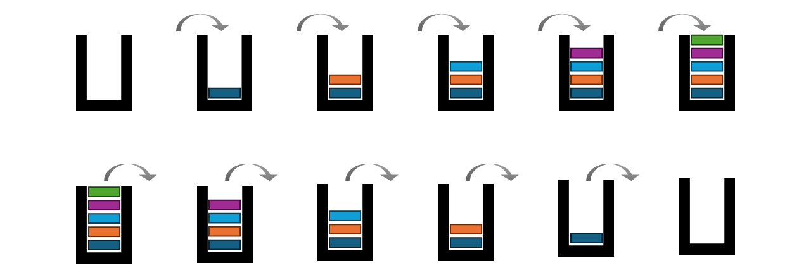

<h1>
  Stacks in Java
  Stacks
</h1>

**Learning objective:** By the end of this lesson, you'll be able to explain what is a stack data structure.

## Introduction
A Stack is a linear data structure which behaves like real-world stacks. Like stack of books or plates, data items are arranged one on top of each other.

### Characteristics of a stack data structure
- A stack has only one end - the top end - from where a data item can be inserted, read, or deleted.
- Everytime an item is inserted, it becomes the topmost item.
- Upon deletion of the topmost item, the item previously below it will become the topmost item.
- It follows the LIFO (Last-In-First-Out) principle. The last item inserted  into the stack will be the first one to be deleted.
- No item in a stack data structure can be updated (Changed). They can only be inserted or removed.

Stacks can be **static** when a limit a limit is put on the number of items that can be inserted into it, or they can be **dynamic** where their capacity grows every time an item gets inserted.

## Common stack operations
- **Push** : Inserts a data item onto the top of the stack.
- **Pop** : Reads and returns the item at the top of the stack and deletes it.
- **Peek** : Reads the value of the item on top of the stack without deleting it.
- **isEmpty** : Checks if the stack is empty and returns a boolean `true` or `false`.
- **isFull** : Checks if the number of items in the stack has reached its upper limit (stack size) and returns a boolean `true` or `false`.
- **Size** : Returns the number of non-empty data elements present in a stack.

## Final reflections
- A stack is a LIFO data structure.
- Stacks are the backbone of many common algorithms that we encounter in most applications like: 
  - Undo/redo features in editors and applications.
  - Backtracking functionality in web browsers.
  - Verifying the correctness of nested parentheses or brackets in code.
- Mastering stacks encourages programmers to think logically and systematically, an essential skill for algorithm design.